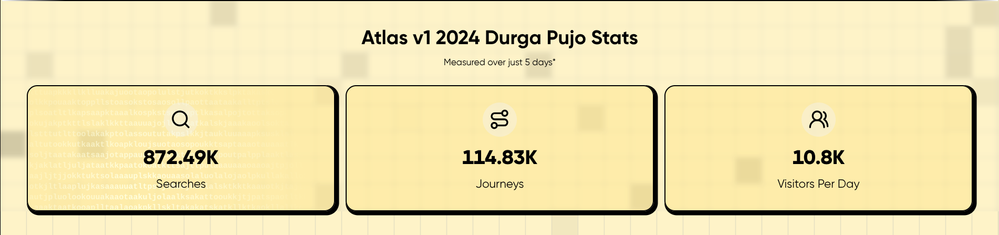
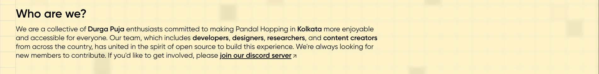
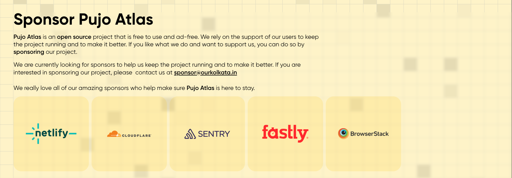

<!-- 

 -->

## Community

For help, discussion about best practices, or any other conversation that would benefit **PujoAtlasKol-Web**: [Join the Pujo Atlas Discord Server](https://discord.com/invite/xxSXWYf6d4)

## Contributors

We 💖 contributors! Feel free to contribute to this project but **please read the [Contributing Guidelines](CONTRIBUTING.md) before opening an issue or PR** so you understand the branching strategy and local development environment. We also welcome you to join our [Discord](https://discord.com/invite/xxSXWYf6d4) community for either support or contributing guidance.

## License

This project is licensed under the MIT License - see the [LICENSE](LICENSE) file for details.

## Sponsors

A special thank you to **[Netlify](https://www.netlify.com/)**, **[Cloudflare](https://www.cloudflare.com/)**, **[Sentry](https://sentry.io/)**, **[Fastly](https://www.fastly.com/)** and **[BrowserStack](https://www.browserstack.com/)** for sponsoring **Pujo Atlas**!

## Support Us

Pujo Atlas is an open source project that is free to use and ad-free. We rely on the support of our users to keep the project running and to make it better. If you like what we do and want to support us, you can do so [by donating to our project](https://atlas.ourkolkata.in/support). For any doubts or queries regarding donating to Pujo Atlas, please enquire in our [Discord Server](https://discord.com/invite/xxSXWYf6d4).

This project is tested with BrowserStack.
